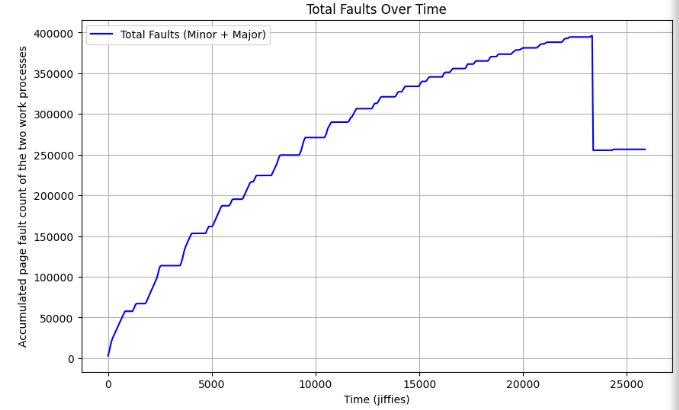

# MP3-PageFaultProfiler

The **Virtual Memory Page Fault Profiler** is a kernel-level tool that monitors and analyzes the **page fault rates** and **CPU utilization** of user processes running Linux. The profiler, which is implemented as a kernel module, registers and unregisters processes via a **Proc filesystem entry** ('/proc/mp3/status'), allowing for efficient monitoring of memory usage patterns. It uses a **shared memory buffer** (created with 'vmalloc()') to hold profiling data, minimizing unnecessary overhead from user-kernel communication. Metrics such as **major and minor page fault counts** and **CPU utilization** are collected 20 times per second and kept for a maximum of 12,000 samples. A **character device driver** allows user processes to map this buffer into their virtual address space with'mmap()', providing smooth access to profiling data.

The project analyzes workload characteristics through synthetic user-level processes that simulate memory access patterns. By examining trends in page faults and CPU utilization, it identifies performance bottlenecks like memory thrashing and the effects of multiprogramming. This implementation combines the use of kernel APIs, including work queues, character devices, and memory management functions, providing valuable insights into the virtual memory system's behavior under varying workloads.

# ANALYSIS 
CASE STUDY 1: 

